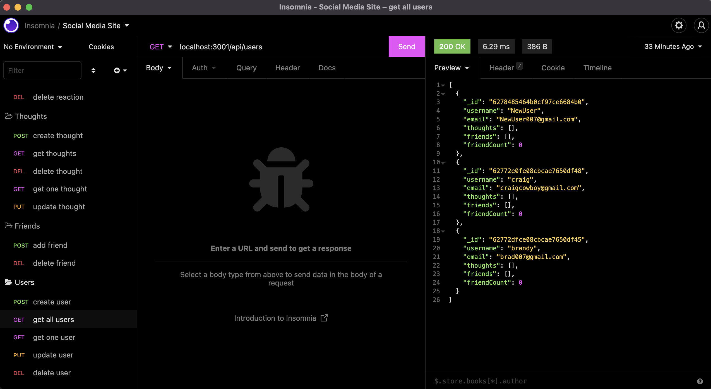

# Thoughts - social media app back end

## Description

Thoughts is a social media platform for users to connect with friends and share what's on their mind. This RESTful API was built with Mongodb and the Mongoose ODM. CRUD methodes have been built out for users, friends, thoughts and reactions to user thoughts.

### Check out the Demo here

## Table of Contents

[Installation](#installation)

[Usage](#usage)

[License](#license)

[Contributing](#contributing)

[Tests](#tests)

[Questions](#questions)

## Installation

`npm i`

## Usage

npm i and enjoy :)

## License

This project is licensed under the MIT license

## Contributing

If you want to contribute, you can fork the repo and submit a PR request.

## Tests

No tests to run

## Questions

If you have any questions about the repo, open an issue or contact me directly at [heythereimdavidcurtis@gmail.com](mailto:heythereimdavidcurtis@gmail.com). You can find mor of my work at [DavidebCurtis](https://github.com/DavidebCurtis)
